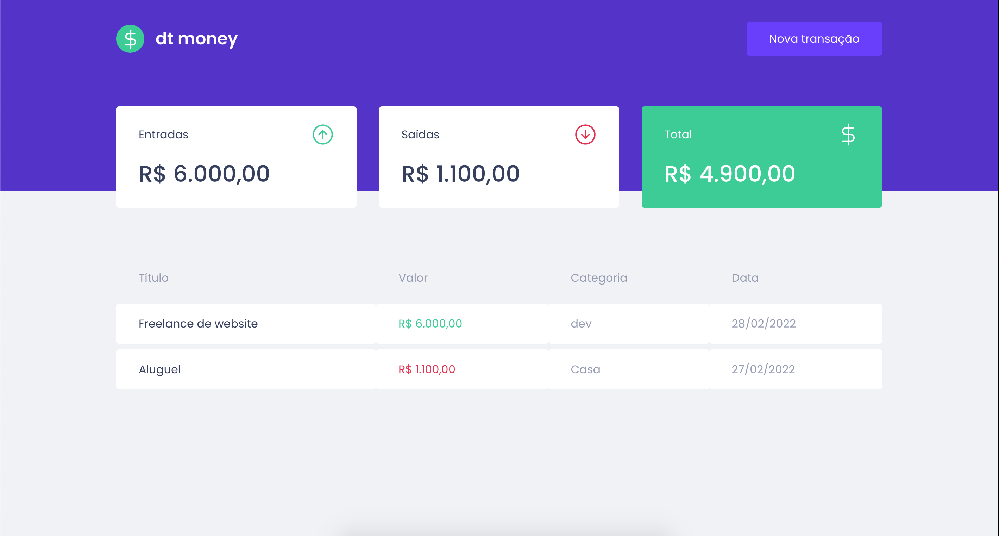
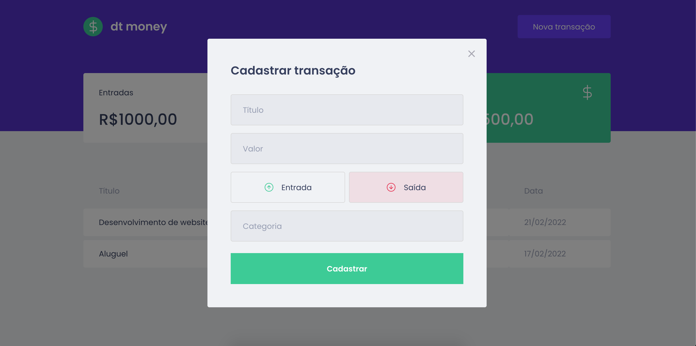

#  💻  dtmoney

No módulo II da trilha ReactJS do Ignite foi contruída uma aplicação front-end web completa utilizando conceitos e ferramentas importantes do ecossistema React como Styled Components, MirageJS, Context API, hooks, Axios e muito mais.
<br>


<p align="center">
    
</p>

<p align="center">
    
</p>

# :rocket: Technologies
This project was made using the follow technologies:

* [Typescript](https://www.typescriptlang.org/)      
* [React](https://reactjs.org/)      
* [Styled Components](https://styled-components.com/)
* [MirageJS](https://miragejs.com/)

# :computer: How to run

```bash
# Clone Repository
$ git clone https://github.com/rakelmm/dtmoney.git
```

```bash
# Install Dependencies
$ yarn
# Run Aplication
$ yarn start
# Go to
$ http://localhost:3000/
```
---

Feito com ❤️ por Rakel Moreira.
