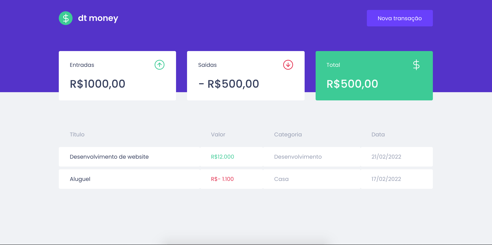

#  💻  dtmoney

No módulo II da trilha ReactJS do Ignite foi contruída uma aplicação front-end web completa utilizando conceitos e ferramentas importantes do ecossistema React como Styled Components, MirageJS, Context API, hooks, Axios e muito mais.
 

    

    

